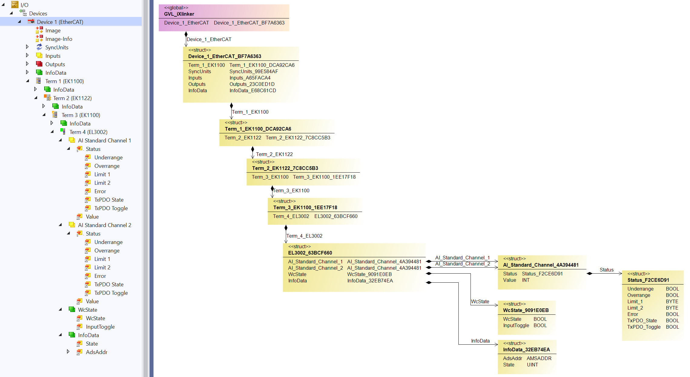
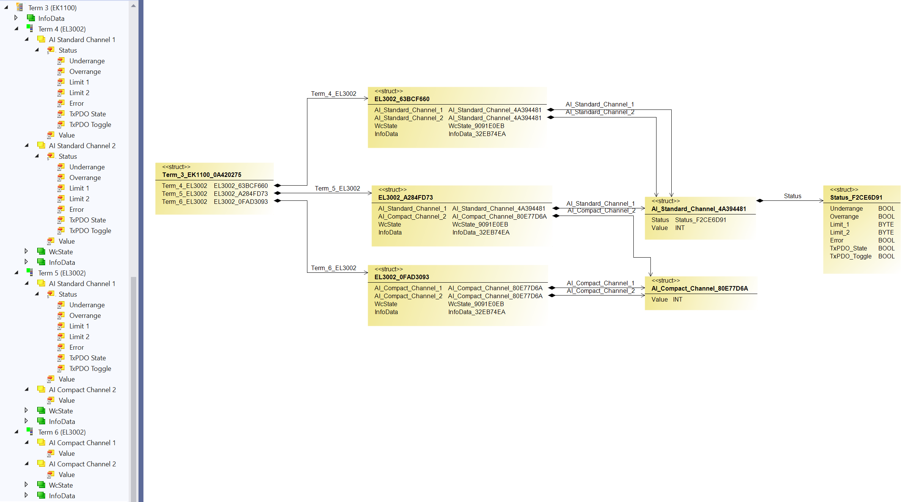
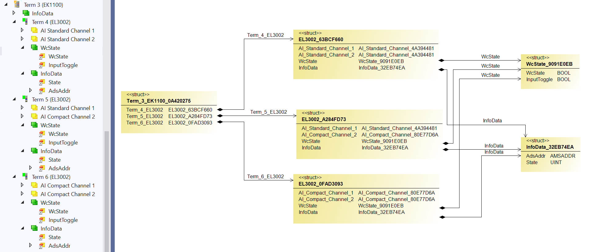

# iXLinker
The **iXLinker** is a tool for Visual Studio and Twincat 3 by Beckhoff, providing an automatic mapping of the EtherCAT slaves.
## How it works
The **iXlinker** uses the content of the XAE project (.tsproj file) as a source and the PLC project (.plcproj file) as a destination. No device description files for the slaves used are necessary.  
The **iXlinker** creates the global variable list with one instance for each EtherCAT master device found in the XAE project, inside the PLC project. 
The generated structure of each EtherCAT master device consists of four instances of the structures related to the master device itself (‘SyncUnits’, ‘Inputs’, ‘Outputs’, and ‘InfoData’) and of the instances of the structures of the EtherCAT slaves directly connected to the “top-level” of the EtherCAT network. 
These slaves could be the standalone devices (i.e. servo-drive AX5000) with a limited number of configurations or modular ones with an unlimited combination of the submodules used (i.e. coupler EK1100 + terminals). Each structure of the modular EtherCAT slave consists of the structure related to this slave itself (i.e. ‘InfoData’) and of the instances of the structures of the EtherCAT modules directly connected to the E-BUS of the EtherCAT coupler. 
The following picture shows the nesting structure where the master ‘Device 1’ structure includes only the ‘Term 1’ instance (EtherCAT coupler EK1100). The ‘Term 1’ structure includes only the ‘Term 2’ instance (EtherCAT junction box EK1122).  The ‘Term 2’ structure includes only the ‘Term 3’ instance (EtherCAT coupler EK1100). And the ‘Term 3’ structure includes only the ‘Term 4’ instance (EtherCAT terminal EL3002). 

Furthermore, the structure of each E-Bus terminal contains the instances of the structures of all Process Data Object (PDO) reflecting the actual configuration of the specific terminal. 
The following picture shows three E-Bus terminals of the same type, but with a different configuration. So for each terminal, a different structure is created, as ‘Term 5’ is different from ‘Term 4’ and ‘Term 6’ is different from ‘Term 5’ so as to ‘Term 4’. 

Except for all PDOs, the E-Bus terminal structure contains ‘WcState’ structure and ‘InfoData‘ structure also reflecting the actual E-Bus terminal settings as shown in the picture below.

Moreover, each EtherCAT slave extends from some base structures that are irrelevant for the stand-alone XAE project, but with connection with [TcOpen]( https://github.com/TcOpenGroup/TcOpen/#tcopen), this could be used for a different view in the autogenerated HMI application. 
In short, EtherCAT slave directly connected to EtherCAT network extends from ‘EtcSlaveBoxBase’, while EtherCAT slave directly connected to E-Bus network extends from ‘EtcSlaveTerminalBase’ as shown in the picture below.

A more detailed description of the base structures could be found [here]( https://github.com/TcOpenGroup/TcOpen/tree/dev/src/TcoIo#base-structures)

## Instalation 
The **iXLinker** is available to download as a nuget package [here]( https://www.nuget.org/packages/Inxton.iXlinker)
As the TwinCAT XAE project does not support the nuget packages (or did not support at the time of writing this documentation), this limitation could be overcome by adding an empty project that supports them. See the [videos](https://www.youtube.com/playlist?list=PL-0IxLiTmB6Lrpp0_ZV-eIsZjPALOBqyh) for detailed information.

## How to use it 
In the background, the iXlinker is the CLI executable. 
So it could be placed once somewhere on the hard drive and triggered using the command line with the absolute paths to XAE project and PLC project. Type **iXlinker.exe /?** into the command line in the directory where this file is placed to get the complete list of arguments. In such a case only the iXlinker.exe file is necessary all the others could be deleted.
Or it could be triggered via VSIX extension inside Visual Studio, which prefills the arguments from the currently opened solution and calls the executable placed inside the solution folder.

----------------------------------
## Prerequisites
1. [Visual Studio 2019 (at least Community Edition)](https://visualstudio.microsoft.com/vs/older-downloads/) v16.8.3+
1. [TwinCAT 3.1 eXtended Automation Engineering (XAE)]( https://www.beckhoff.com/en-en/products/automation/twincat/te1xxx-twincat-3-engineering/te1000.html) TwinCAT 3.1 4024.22+
1. [.NET5 developer pack](https://dotnet.microsoft.com/en-us/download/dotnet/5.0) (5.0.17)

