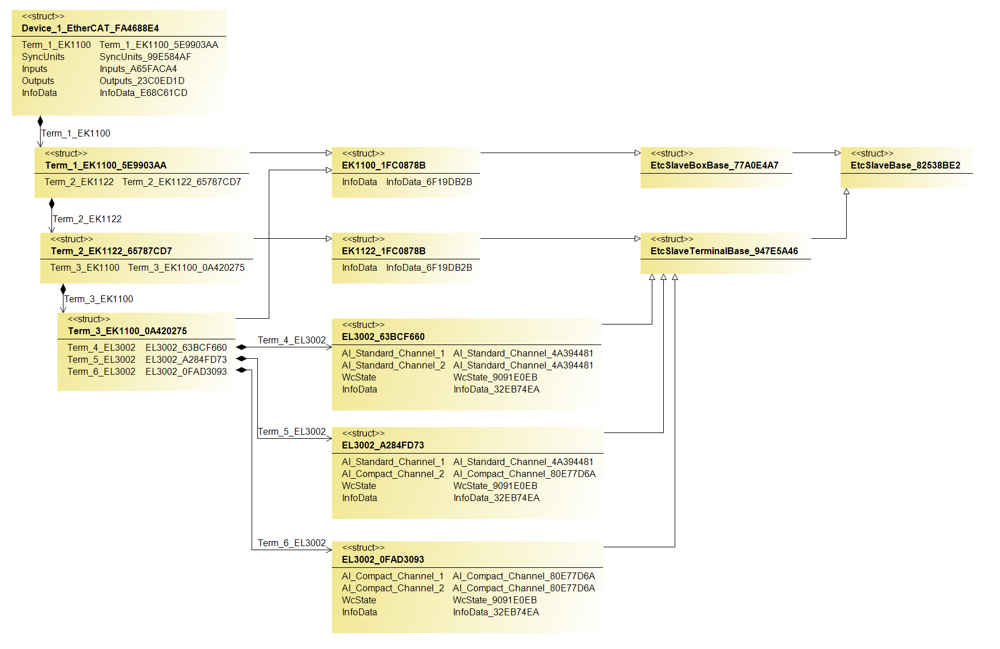

# iXLinker
The **iXLinker** is a tool for Visual Studio and [Twincat 3](https://www.beckhoff.com/en-en/products/automation/twincat/twincat-3-build-4024/) that provides automatic mapping of EtherCAT slaves.
## How it works
The **iXlinker** uses the content from the XAE project (.tsproj file) as its source and the PLC project (.plcproj file) as its destination. No device description files for the slaves used are necessary.
The **iXlinker** creates a global variable list inside the PLC project with one instance of each EtherCAT master device found in the XAE project. 
The generated structures of each EtherCAT master device comprise of four instances of the structures related to the master device itself (‘SyncUnits’, ‘Inputs’, ‘Outputs’, and ‘InfoData’) and the instances of the structures associated with the EtherCAT slaves directly connected to the “top-level” EtherCAT network.
These slaves could be standalone devices (i.e. servo-drive AX5000) with a limited number of configurations or modular ones with an unlimited combination of submodules used (i.e. coupler EK1100 + terminals). Each structure of a modular EtherCAT slave consists of the structure related to this slave itself (i.e. ‘InfoData’) and of the structures associated with the EtherCAT modules directly connected to the E-BUS of the EtherCAT coupler. 
The following picture depicts the nesting structure where the master ‘Device 1’ structure includes only the ‘Term 1’ instance (EtherCAT coupler EK1100). The ‘Term 1’ structure includes only the ‘Term 2’ instance (EtherCAT junction box EK1122).  The ‘Term 2’ structure includes only the ‘Term 3’ instance (EtherCAT coupler EK1100). And the ‘Term 3’ structure includes only the ‘Term 4’ instance (EtherCAT terminal EL3002). 

Furthermore, each E-Bus terminal's structure includes the instances of all Process Data Objects' structures (PDO) containing the actual configuration of the specific terminal. The below picture shows three E-Bus terminals of the same type, but with a different configuration. So, for each terminal a different structure is created, as ‘Term 5’ is different from ‘Term 4’, ‘Term 6’ is different from ‘Term 5’ and so on. 

Moreover, the E-Bus terminal structure also contains a ‘WcState’ structure and an ‘InfoData‘ structure which in turn reflect the actual E-Bus terminal settings as shown below.

 Please note that while each EtherCAT slave extends from base structures that are not relevant to standalone XAE projects they may still be of use with [TcOpen]( https://github.com/TcOpenGroup/TcOpen/#tcopen), which can create a different view in the autogenerated HMI application. 
In short, EtherCAT slave directly connected to an EtherCAT network extends from ‘EtcSlaveBoxBase’, while EtherCAT slave directly connected to E-Bus network extends from ‘EtcSlaveTerminalBase’ as shown on the picture below.

A more detailed description of the base structures could be found [here]( https://github.com/TcOpenGroup/TcOpen/tree/dev/src/TcoIo#base-structures)

## Installation 
The **iXLinker** is available to download as a nuget package [here]( https://www.nuget.org/packages/Inxton.iXlinker)
Although the TwinCAT XAE project does not support nuget packages (or at the time of writing), adding an empty project that supports them would overcome this limitation. See the [videos](https://www.youtube.com/playlist?list=PL-0IxLiTmB6Lrpp0_ZV-eIsZjPALOBqyh) for detailed information.

## How to use it 
iXlinker is a CLI executable that runs in the background. 
Thus, it could be saved somewhere on the hard drive and triggered using the command line with the absolute paths to XAE project and PLC project. Type **iXlinker.exe /?** into the command line in the directory where this file is located to get the complete list of arguments. For CLI use only the iXlinker.exe file is necessary, consequently all other files could be deleted.

Alternatively, iXlinker could be triggered via a VSIX extension inside Visual Studio, which fills the arguments for the currently opened solution and calls the executable inside the solution folder automatically.

----------------------------------
## Prerequisites
1. [Visual Studio 2019 (at least Community Edition)](https://visualstudio.microsoft.com/vs/older-downloads/) v16.8.3+
1. [TwinCAT 3.1 eXtended Automation Engineering (XAE)]( https://www.beckhoff.com/en-en/products/automation/twincat/te1xxx-twincat-3-engineering/te1000.html) TwinCAT 3.1 4024.22+
1. [.NET5 developer pack](https://dotnet.microsoft.com/en-us/download/dotnet/5.0) (5.0.17)

